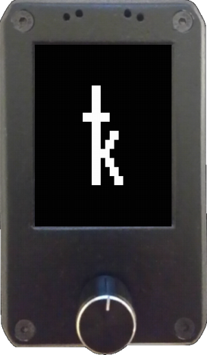

[](https://github.com/selfcustody/krux/commit/bb8e2d63e031417111ff7cb2b8877c10e19410be)
[](https://github.com/selfcustody/krux/releases)
[](https://github.com/selfcustody/krux/releases)
[](https://github.com/selfcustody/krux/graphs/contributors)
[](https://github.com/selfcustody/krux/commits)
[](https://codecov.io/gh/selfcustody/krux)
[](https://calver.org)
[](https://github.com/selfcustody/krux/blob/main/LICENSE.md)

<p align="center">





</p>

Krux is an open-source firmware facilitating the creation of Bitcoin signing devices from readily available components, such as Kendryte K210 devices. It transforms these devices into airgapped tools capable of handling transactions for both single and multisignature wallets, supporting offline signing via QR code or SD card, thus empowering users to securely self-custody their Bitcoin.

---
## Disclaimer
**WARNING**: *This software has not yet been formally audited by a third party. Use at your own risk!*

---

## 中文新手入口
如果你第一次接触这份备份仓库，先按这个顺序看：

1. [Krux 仓库结构与接手说明](docs/getting-started/installing/repo-structure.zh-CN.md)
2. [Amigo 中文新手入口](docs/getting-started/index.zh-CN.md)
3. [Amigo 预编译固件中文教程](docs/getting-started/installing/from-pre-built-release.zh-CN.md)
4. [Amigo 源码编译中文教程](docs/getting-started/installing/from-source.zh-CN.md)
5. [Amigo 商用交付说明](docs/amigo-commercial-release.zh-CN.md)
6. [Amigo 常见问题](docs/faq.zh-CN.md)
7. [Amigo 迁移计划 / 接手记录](docs/amigo-tp-web3-port-plan.zh-CN.md)

最省事的路径是第 3 条；如果你想先看中文总入口，再点第 2 条。
如果你想先看这份固件到底能不能商用、交付范围是什么，先看第 5 条。
如果你经常被“能不能接智能卡、为什么固件这么小、能不能接 USB 打印机”这些问题困住，先看第 6 条。

这份备份仓库的主地址是 `https://github.com/akg5188/krux`，子模块 `MaixPy` 也已经单独备份到 `https://github.com/akg5188/MaixPy`。

如果你要继续这轮 Amigo 迁移，优先看备份仓库里的 `amigo-snapshot` 分支，这是一份可以直接接手的工作快照。

---

# Getting Started
Detailed instructions for installing and running Krux can now be found in our [official documentation](https://selfcustody.github.io/krux/).

## 中文快速开始
上面的“中文新手入口”已经把最重要的路径排好了。

如果你只想先把 Amigo 刷起来，直接点第 3 条。
如果你已经知道自己要改什么，再按第 1 条和第 4 条往下看。

如果你以后要维护这份备份，请先记住：

- `krux` 是主仓库，放界面、菜单、文档、测试和大部分功能。
- `firmware/MaixPy` 是子模块，放 Amigo 的底层板级支持。
- 只改上层功能时，一般只动 `krux`；只改底层硬件时，才进 `firmware/MaixPy`。
- 修改了 `firmware/MaixPy` 以后，要先推子模块，再回到父仓库更新 submodule 指针。

## Krux-installer
If you just want to flash (or "install") Krux firmware on your device and are not familiar with the command line, just use our Krux-Installer.

### Download our Krux-Installer
[](https://github.com/selfcustody/krux-installer/releases)

## 维护者入口
下面这部分主要给要改代码、跑测试、生成截图的人看。
如果你只是想先把 Amigo 刷起来，前面的中文新手入口已经够了。

最常用的几条命令先记住：

- 编译 Amigo 固件：`./krux build maixpy_amigo`
- 烧录 Amigo 固件：`./krux flash maixpy_amigo`
- 跑单元测试：`poetry run poe test`
- 跑 Amigo 模拟器：`poetry run poe simulator`
- 生成本地文档站：`poetry run poe docs`

# Development
The **instructions below are intended for programmers or developers** who would like to contribute to the project.

## Download our firmware releases
[](https://github.com/selfcustody/krux/releases)

## Fetch the code
This will download the source code of Krux as well as the code of all its dependencies inside a new folder called `krux`:
```bash
git clone --recurse-submodules https://github.com/akg5188/krux
```

Note: When you wish to pull updates (to all submodules, their submodules, ...) to this repo, use:
```bash
git pull origin main && git submodule update --init --recursive
```

## Krux (script) (Linux or WSL)
The [krux](krux) bash script contains commands for common development tasks. It assumes a Linux host, you will need to have [Docker Desktop or Docker Engine](https://docs.docker.com/desktop/) (don't forget to add your user to the docker group `sudo usermod -aG docker $USER`), `openssl`, and `wget` installed at a minimum for the commands to work as expected. It works on Windows using WSL. The channel Crypto Guide from Youtube made a step-by-step video - [Krux DIY Bitcoin Signer: Build From Source & Verify (With Windows + WSL2 + Docker)](https://www.youtube.com/watch?v=Vmr_TFy2TfQ)

To build and flash the firmware:
```bash
# build firmware for Maix Amigo
./krux build maixpy_amigo

# flash the firmware to Maix Amigo
./krux flash maixpy_amigo
```

The first time, the build can take around an hour or so to complete. Subsequent builds should take only a few minutes. If all goes well, you should see a new `build` folder containing `firmware.bin` and `kboot.kfpkg` files when the build completes.

## Install Krux and dev tools
Krux uses [Poetry](https://python-poetry.org/) as Python packaging and dependency management. This cmd installs development dependencies like [embit](https://github.com/diybitcoinhardware/embit), [ur](https://github.com/selfcustody/foundation-ur-py) and [urtypes](https://github.com/selfcustody/urtypes), and tools to run [tests](https://docs.pytest.org), review code with [pylint](https://pypi.org/project/pylint/), format code with [black](https://github.com/psf/black) and a lib to help handle i18n translations.
```bash
pip install poetry
poetry install
```

If you have a problem installing Poetry on Linux OS:
```bash
# we considered the name of the venv .krux
python -m venv .krux
source .krux/bin/activate
```
The result will be something like:
```bash
(.krux) username:~/directory name$ 
```
Now you can run normaly the pip of the poetry:
```bash
pip install poetry
poetry install
```

Note: when changing the dependencies in `pyptoject.toml` you need to generate a new `poetry.lock` file using the cmd: `poetry lock --no-update`.

## Format code
```bash
poetry run poe format
```

## Review code
```bash
poetry run poe lint
```

## Run tests with coverage
```bash
poetry run poe test
```

Note: The coverage report will be created at the `htmlcov` folder `file:///path/to/krux/htmlcov/index.html`. 

For more verbose output (e.g., to see the output of print statements):
```bash
poetry run poe test-verbose
```

To run just a specific test from a specific file:
```bash
poetry run pytest --cache-clear ./tests/pages/test_login.py -k 'test_load_key_from_hexadecimal'
```

## Use the Python interpreter (REPL)
This is useful for rapid development of non-visual code:
```bash
poetry run python
```
```
Python 3.9.1
Type "help", "copyright", "credits" or "license" for more information.
>>> from krux.key import Key
>>> Key("olympic term tissue route sense program under choose bean emerge velvet absurd", False).xpub()
'tpubDCDuqu5HtBX2aD7wxvnHcj1DgFN1UVgzLkA1Ms4Va4P7TpJ3jDknkPLwWT2SqrKXNNAtJBCPcbJ8Tcpm6nLxgFapCZyhKgqwcEGv1BVpD7s'
>>>
```

## Run the device simulator
这个模拟器适合先看界面和流程，但它不等于真机。Amigo 是触摸屏设备，真机上的触摸、相机、SD 卡和串口行为还是以实际硬件为准。

This is useful for rapid code development that utilizes UI/UX. It is also good for newcomers to try Krux before purchasing a device. However, the simulator does not behave exactly as the HW device and may not have all features implemented (e.g. scanning via camera a TinySeed currently only works on the HW device).

Before executing, make sure you have installed the poetry extras:
```bash
# This cmd will uninstall other extras
poetry install --extras simulator

# To install all extras, use:
poetry install --all-extras
```

Run the simulator:
```bash
# Run simulator with the touch device Amigo, then use mouse to navigate
poetry run poe simulator

# Run simulator with SD enabled (folder `simulator/sd`) on the small button-only device M5stickV, then use keyboard (arrow keys UP or DOWN and ENTER)
poetry run poe simulator-m5stickv --sd

# Run simulator on the device dock, then use keyboard (arrow keys UP or DOWN and ENTER)
poetry run poe simulator-dock

# Run simulator with the touch device yahboom, then use mouse to navigate
poetry run poe simulator-yahboom

# Run simulator on the device cube, then use keyboard (arrow keys UP or DOWN and ENTER)
poetry run poe simulator-cube

# Run simulator with the touch device wonderMV, then use mouse to navigate
poetry run poe simulator-wonder-mv

# Run simulator with the touch device tzt, then use mouse to navigate
poetry run poe simulator-tzt
```

Note: With emulated SD card it is possible to store settings, encrypted mnemonics, also drop and sign PSBTs. After some time running, the simulator may become slow. If that happens, just close and open again!

```bash
# ImportError: Unable to find zbar shared library
sudo apt install python3-zbar

# ImportError: libGL.so.1: cannot open shared object file: No such file or directory
sudo apt install libgl1

# `pygame.error: No available video device`
# You are trying to run the simulator on an OS without a GUI (some kind of terminal only or WSL). Try one with GUI!

# Depending on the OS, it may be necessary to install zbar-tools too:
sudo apt install zbar-tools
```

### Simulator sequences execution

This is useful for taking screenshots of device screens to use in documentation:
```bash
# Run all sequences of commands on all devices and in all locales (languages) [Linux OS]
cd simulator
./generate-all-screenshots.sh

# Run a specific sequence for a specific device's with SD enabled (folder `simulator/sd`)
poetry run poe simulator --sequence sequences/about.txt --sd

# Sequence screenshots are scaled to fit in docs. Use --no-screenshot-scale to get full size
poetry run poe simulator --sequence sequences/home-options.txt --no-screenshot-scale
```

## 连接设备调试（Linux / Live debug）
这部分是给开发者看的。如果你已经刷好新固件，想直接看串口输出，可以用 `screen` 连到设备。
我们默认关闭了 `MICROPY_ENABLE_COMPILER`，所以现在不能像早期那样直接进实时 Python REPL；如果你自己重新打开这个开关，才可以用 `Ctrl-C` 打断进入命令行。

如果你已经重新编译并刷进设备，可以用下面的命令连串口：
```bash
screen /dev/tty.usbserial-device-name 115200
```

连接成功后，设备会重启并打印启动日志，下面是一个示例：
```bash
K210 bootloader by LoBo v.1.4.1

* Find applications in MAIN parameters
0: '       firmware', @ 0x00080000, size=XXX, app_size=XXX, App ok, ACTIVE
* Loading app from flash at 0x00080000 (XXX B)
* Starting at 0x80000000 ...


[MAIXPY] Pll0:freq:XXX
[MAIXPY] Pll1:freq:XXX
[MAIXPY] Pll2:freq:XXX
[MAIXPY] cpu:freq:XXX
[MAIXPY] kpu:freq:XXX
[MAIXPY] Flash:0xef:0x17
[MaixPy] gc heap=0x8029f430-0x8036f430(851968)
init i2c:2 freq:XXX
[MAIXPY]: find ov7740
[MAIXPY]: find ov sensor
```
像 Amigo 这类设备可能会出现两个串口，如果第一个没有输出，就换第二个试试。

退出 `screen` 串口监视器时，先按 `Ctrl+a`，再按 `k`，最后输入 `y` 确认。

## 使用 MaixPy IDE 调试设备（Mac / Windows）
如果你在 Mac 或 Windows 上调试，也可以用 [MaixPy IDE](https://dl.sipeed.com/shareURL/MAIX/MaixPy/ide/v0.2.5) 通过串口看日志。
菜单路径是 `Tools > Open Terminal > New Terminal > Connect to serial port > Select a COM port available`；如果第一个串口不行，就换另一个。
因为体积限制，我们删掉了部分 MaixPy IDE 支持，但串口调试还是可用的。

## WDT 看门狗
Krux 使用了 MaixPy 的 [WDT watchdog 模块](https://wiki.sipeed.com/soft/maixpy/en/api_reference/machine/wdt.html)，代码在 [这里](src/krux/wdt.py)。如果一段时间不喂狗，设备会自动重启。
如果你已经连上串口，想临时停掉它，可以运行下面这段代码。（从 v24.07.0 开始，因为关闭了 Python 实时编译器和 REPL，这个操作已经不再方便在设备上临时执行。）
```python
# 每次想停掉看门狗时都运行一次

from krux.wdt import wdt
wdt.stop()
```

停掉看门狗以后，你就可以正常调试设备了。别忘了把 `Settings > Security > Shutdown Time` 设成 `0`，这样设备就不会再自动重启；如果你加了 `print`，它们会在代码执行到时直接出现在串口里。

## 翻译维护（i18n）
如果你要继续补中文或者新增语言，先看这里。

项目里的翻译文件都在 [这里](i18n/translations)。如果你在代码里用 `t()` 新增了一条英文文案，就要同步处理翻译文件，否则别的语言会缺字。

```bash
# 清理没用到的翻译：
poetry run poe i18n clean

# 新建一个 JSON 翻译文件：
poetry run poe i18n new tr-TR

# 用 Google 翻译补缺失内容，再复制到对应文件里，最后人工检查措辞和逗号。
poetry run poe i18n fill

# 只补某一种语言的缺失翻译，例如巴西葡萄牙语
poetry run poe i18n fill pt-BR

# 确认所有语言文件都包含这条新文案：
poetry run poe i18n validate

# 格式化翻译文件：
poetry run poe i18n prettify

# 生成给 krux translations.py 用的编译表
poetry run poe i18n bake
```

## 字体说明
如果你遇到字形缺失、字号不对、换行很怪，先看 [字体说明](firmware/font/README.md)。

## 颜色与配色
如果你要改主题颜色，可以用 [这个脚本](firmware/scripts/rgbconv.py) 把 RGB 值转换成设备可用的颜色值。

## 文档维护
如果你要改文档、生成本地文档站，这一节就是入口。

在改文档或启动 mkdocs 之前，先确保已经安装了文档相关的 poetry extras：

```bash
# 这条命令会替换掉其他 extras
poetry install --extras docs

# 如果你想安装全部 extras，用这个：
poetry install --all-extras
```

要修改文档左侧和上方菜单，请看 `mkdocs.yml` 里的 `nav` 部分。要创建或编辑文档翻译，可以先看 [这里](i18n/README.md)。

在本地生成文档站点，访问 `http://127.0.0.1:8000/krux/`：
```bash
poetry run poe docs
```

## 参考项目
这些项目给了 Krux 很多思路：
- https://github.com/SeedSigner/seedsigner：Raspberry Pi（Zero）上的参考项目
- https://github.com/diybitcoinhardware/f469-disco：F469-Discovery 开发板上的参考项目

## 依赖组件
下面这些库和底层组件支撑了 Krux：
- [embit](https://embit.rocks/)：Python 3 和 MicroPython 用的比特币库
- [MaixPy](https://github.com/sipeed/MaixPy)：K210 RISC-V 上的 MicroPython 端口
- [MicroPython](https://github.com/micropython/micropython)：面向微控制器和资源受限系统的轻量高效 Python 实现
- [Kboot](https://github.com/loboris/Kboot) 和 [ktool](https://github.com/loboris/ktool)：启动器和刷机工具

## 贡献方式
欢迎提 issue 和 PR。我们尽量把它做得更好。

你可以去 [Discussions](https://github.com/selfcustody/krux/discussions) 开讨论，或者直接提 [issue](https://github.com/selfcustody/krux/issues)。如果你要提 PR，最好先说清楚它解决了什么，尽量一个 PR 对应一个问题；如果修改彼此紧密相关，可以合在一起。

**PR 注意**：请从 `develop` 分支拉分支，也请明确把目标分支指向 `develop`。`main` 是最新稳定版，同时也是从源码下载和安装时常用的分支。

## 技术支持
如果你在安装或使用 Krux 时需要帮助，可以加入我们的 [Telegram 聊天](https://t.me/KruxDIY)。
也可以关注我们的 [X（Twitter）](https://x.com/selfcustodykrux)，或者去 [Bitcoin Forum](https://bitcointalk.org/index.php?topic=5489022.0) 发消息。
另外，Telegram 上还有更大的 [DIYbitcoin 聊天](https://t.me/diybitcoin) 社区，适合喜欢折腾、动手和研究的人。

请不要把 issue 当成普通客服入口。如果需要，也可以去 [Discussions](https://github.com/selfcustody/krux/discussions) 在 GitHub 上发问。
