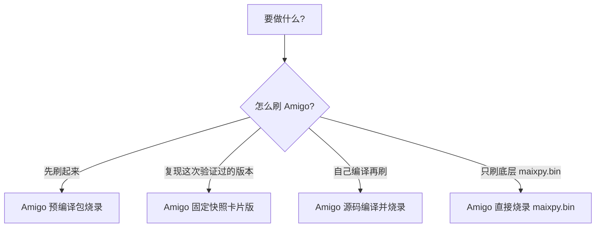

# Amigo 刷机路径图

如果图没渲染出来，就直接按下面选：

- 先刷起来 -> [Amigo 预编译包烧录](from-pre-built-release.zh-CN.md)
- 复现这次验证过的版本 -> [Amigo 固定快照卡片版](from-github-snapshot-quick.zh-CN.md)
- 自己编译再刷 -> [Amigo 源码编译并烧录](from-source.zh-CN.md)
- 只刷底层 `maixpy.bin` -> [Amigo 直接烧录 `maixpy.bin`](from-maixpy-bin.zh-CN.md)
